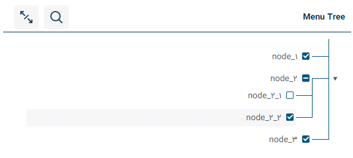

# React-Checkbox-Menu-Tree

React Checkbox Menu Tree is a versatile and customizable tree menu component for Reactjs applications. It allows users to navigate through hierarchical data and select multiple nodes using checkboxes. This component is suitable for creating complex nested menus, category trees, or any other hierarchical data representation with selectable options, although you can access to each node data without using checkboxes with onClick function that is accessible on each node.

## Examples

click [here](https://hoseinmohajer.github.io/react-checkbox-menu-tree/) to see all the examples.

## Donate

Help me to stack sats!

0xB4B2008f50E945fA28a99f2A650a9bF97C3d55eC

## Features

Flexible Data Structure: The component supports a customizable approach to data, allowing you to define various properties for each node in the tree, allowing you to define custom theme and set custom text for buttons title.

Feature include:

- Flexible approach to data, with customizable properties
- Right-to-Left (RTL) Support: The tree menu can be displayed in right-to-left orientation, accommodating languages that require RTL layout.
- Customizable Widgets: Each node can have a custom widget (React component) associated with it, enabling you to implement specific actions like opening a modal for individual nodes.
- onClick Function Parameters: When a node is clicked, the onClick function is triggered, providing access to the data and ID of the checked node(s).
- Optional Checkboxes: You can choose to include checkboxes for nodes, allowing users to select multiple items in the tree.
- Customizable Icons: The component supports customizable icons. You can import your preferred icon package to display icons alongside node titles.
- Optional Header: The tree menu can include an optional header, providing a title for the entire tree, although you can expand and collapse all nodes and search through all tree data within the search box field.
- Custom theme: You can set your custom theme with appropriate colors.
- Custom text: You can set your custom text for some buttons title and some necessary text.

[//]: # "* Customizable style and be able to handle theming"

## Installation

The easiest way to use react-checkbox-menu-tree is to install it from npm and build it into your app with Webpack.

```bash
yarn add react-checkbox-menu-tree
```

or

```bash
npm i --save react-checkbox-menu-tree
```

## Usage

```javascript
import React from "react";
import ReactDOM from "react-dom/client";
import MenuTree from "react-checkbox-menu-tree";
import {
  TCallbackData,
  TCallbackIds,
  TLeftSideWidgetData,
} from "./types/common.ts";

const MockData = [
  {
    id: 1204,
    title: "node_1",
    description: "Lorem ipsum dolor sit amet, consectetur adipisicing elit.",
    ticked: "FULL",
    checkedStatus: "FULL",
    parentId: null,
    tags: ["tag_1", "tag_2", "tag_3"],
    repeat: [],
  },
  {
    id: 1205,
    title: "node_2",
    description: "Lorem ipsum dolor sit amet, consectetur adipisicing elit.",
    ticked: "FULL",
    checkedStatus: "FULL",
    parentId: null,
    repeat: [
      {
        id: 1206,
        title: "node_2_1",
        description:
          "Lorem ipsum dolor sit amet, consectetur adipisicing elit.",
        ticked: "FULL",
        checkedStatus: "FULL",
        parentId: 1205,
        repeat: [],
      },
      {
        id: 1207,
        title: "node_2_2",
        description:
          "Lorem ipsum dolor sit amet, consectetur adipisicing elit.",
        ticked: "FULL",
        checkedStatus: "FULL",
        parentId: 1205,
        tags: ["tag_1", "tag_2", "tag_3"],
        repeat: [],
      },
    ],
  },
  {
    id: 1208,
    title: "node_3",
    description: "Lorem ipsum dolor sit amet, consectetur adipisicing elit.",
    ticked: "FULL",
    checkedStatus: "FULL",
    parentId: null,
    repeat: [],
  },
];

const CustomTheme = {
  name: "custom-theme",
  colors: {
    white: "#FFFFFF",
    white_200: "#f5f5f5",
    white_300: "#e8e8e8",
    white_500: "#eae9e9",
    black_100: "#C9C9C9",
    black_200: "#545454",
    black_300: "#575757",
    black_400: "#1E1E1E",
    primary: "#238103",
    secondary_100: "#c0d8df",
    tertiary: "#ff4e05",
    warning: "#ff0000",
    shadow_100: "#f2f3f5",
    shadow_200: "#bfbfbf",
  },
  fontSize: {
    h5: "18px",
    h6: "14px",
    h8: "12px",
  },
  fontWeight: {
    bold: "bold",
    normal: 400,
    high: 500,
  },
};

const PropertiesMapper = {
  id: "id",
  title: "title",
  description: "description",
  checked: "ticked",
  parentId: "parentId",
  tags: "tags",
  children: "repeat",
  iconName: "iconName",
};

const Translation = {
  result: "result",
  resultCount: "result count",
  close: "close",
  search: "search",
  closeAll: "close all",
  openAll: "open all",
};

const handleClick = (data: TCallbackData, ids: TCallbackIds) => {
  console.log("data: ", data);
  console.log("ids: ", ids);
};

const handleWidgetClick = (data: TLeftSideWidgetData) => {
  return (
    <button onClick={() => console.log("current node data:", data)}>
      click me
    </button>
  );
};

const root = ReactDOM.createRoot(document.getElementById("root"));
root.render(
  <MenuTree
    data={MockData}
    title="Menu Tree"
    leftSideWidget={handleWidgetClick}
    onClick={handleClick}
    hasCheckBox
    loading={false}
    headerLess={false}
    disabled={false}
    theme={CustomTheme}
    propertiesMapper={PropertiesMapper}
    translation={Translation}
  />
);
```

## Props

- **data:** array of object that make the tree
- **loading:** Boolean, showing skeleton loading while it is true
- **title:** title of the tree component if headerLess is false
- **hasCheckBox:** show checkboxes
- **onClick:** a method with two arguments, first one is whole data of selected node and the other one is their ids
- **disabled:** disabling onClick function of each node
- **headerLess:** toggle the header of menu-tree
- **propertiesMapper:** following properties are necessary in react-checkbox-menu-tree, so you can set appropriate property up to your data (**optional**)
  - **id:** must be unique (**required**)
  - **parentId:** the parent id (**required** for children)
  - **title:** string | number (**required**)
  - **tags:** it is a flat array that showing below of each node's title if you define leftSideWidget otherwise showing in front of each node (**optional**)
  - **description:** it is displayed at bottom of title (**optional**)
  - **iconName:** It is displayed before the title, you should set your icon package. (**optional**)
  - **children:** array of objects, each node of children must have a parentId (**optional**)
  - **checked:** NOT | FULL | HAF (**required** if hasCheckBox will true)
- **leftSideWidget:** a reactjs component that showed in front of each node to handle customizable action like open a modal (**optional**)
  - **checked:** NOT | FULL | HAF (**required** if hasCheckBox will true)
- **theme:** an object that includes colors, fontSize, and fontWeight that allow you to customize the component's style (**optional**)
- **translation:** an object that allow you to set some necessary text for component specially some texts that used as button's title (**optional**)
  - **result:** It is displayed at the header
  - **resultCount:** it is displayed at the header
  - **close:** it is displayed at the header in the search box as close button icon's tooltip
  - **search:** it is displayed at the header as search icon's tooltip
  - **closeAll:** it is displayed at the header as toggle icon's tooltip
  - **openAll:** it is displayed at the header as toggle icon's tooltip

### Notice

**propertiesMapper:** This built-in variable is used to specify the variables of each node that may exist in the data array with a different name. You can use this option to introduce the necessary variables required by react-checkbox-menu-tree component to it.

## Examples

### Simple

```javascript
import React from "react";
import ReactDOM from "react-dom/client";
import MenuTree from "react-checkbox-menu-tree";

const MockData = [
  {
    id: 1204,
    title: "node_1",
  },
  {
    id: 1205,
    title: "node_2",
    children: [
      {
        id: 1206,
        title: "node_2_1",
      },
      {
        id: 1207,
        title: "node_2_2",
      },
    ],
  },
];

const root = ReactDOM.createRoot(document.getElementById("root"));
root.render(<MenuTree data={MockData} title="Menu Tree" />);
```


### Checkbox Menu Tree

```javascript
import React from "react";
import ReactDOM from "react-dom/client";
import MenuTree from "react-checkbox-menu-tree";

const MockData = [
  {
    id: 1204,
    title: "node_1",
    checked: "FULL",
    parentId: null,
  },
  {
    id: 1205,
    title: "node_2",
    checked: "HALF",
    parentId: null,
    children: [
      {
        id: 1206,
        title: "node_2_1",
        checked: "NOT",
        parentId: 1205,
      },
      {
        id: 1207,
        title: "node_2_2",
        checked: "FULL",
        parentId: 1205,
      },
    ],
  },
  {
    id: 1208,
    title: "node_3",
    checked: "FULL",
    parentId: null,
  },
];

const root = ReactDOM.createRoot(document.getElementById("root"));
root.render(<MenuTree data={MockData} title="Menu Tree" hasCheckBox />);
```



### Menu-Tree with leftSideWidget

```javascript
import React from "react";
import ReactDOM from "react-dom/client";
import MenuTree from "react-checkbox-menu-tree";

const MockData = [
  {
    id: 1204,
    title: "node_1",
  },
  {
    id: 1205,
    title: "node_2",
    children: [
      {
        id: 1206,
        title: "node_2_1",
      },
      {
        id: 1207,
        title: "node_2_2",
      },
    ],
  },
];

const root = ReactDOM.createRoot(document.getElementById("root"));
root.render(
  <MenuTree
    data={MockData}
    title="Menu Tree"
    leftSideWidget={(data) => {
      return (
        <button onClick={() => console.log("current node data:", data)}>
          click me
        </button>
      );
    }}
  />
);
```


### Menu-Tree with onClick

```javascript
import React from "react";
import ReactDOM from "react-dom/client";
import MenuTree from "react-checkbox-menu-tree";

const MockData = [
  {
    id: 1204,
    title: "node_1",
  },
  {
    id: 1205,
    title: "node_2",
    children: [
      {
        id: 1206,
        title: "node_2_1",
      },
      {
        id: 1207,
        title: "node_2_2",
      },
    ],
  },
];

const root = ReactDOM.createRoot(document.getElementById("root"));
root.render(
  <MenuTree
    data={MockData}
    title="Menu Tree"
    onClick={(data, ids) => {
      console.log("data: ", data);
      console.log("ids: ", ids);
    }}
  />
);
```

**Notice:** The onClick functionality toggles the selected node. When a node is selected, the callback method returns the current node data; otherwise, it returns null.


### Checkbox-Menu-Tree headerLess

```javascript
import React from "react";
import ReactDOM from "react-dom/client";
import MenuTree from "react-checkbox-menu-tree";

const MockData = [
  {
    id: 1204,
    title: "node_1",
    description: "Lorem ipsum dolor sit amet, consectetur adipisicing elit.",
    checked: "FULL",
    parentId: null,
    tags: ["tag_1", "tag_2"],
  },
  {
    id: 1205,
    title: "node_2",
    description: "Lorem ipsum dolor sit amet, consectetur adipisicing elit.",
    checked: "FULL",
    tags: ["tag_1", "tag_2", "tag_3"],
    parentId: null,
    children: [
      {
        id: 1206,
        title: "node_2_1",
        description:
          "Lorem ipsum dolor sit amet, consectetur adipisicing elit.",
        checked: "FULL",
        parentId: 1205,
      },
      {
        id: 1207,
        title: "node_2_2",
        description:
          "Lorem ipsum dolor sit amet, consectetur adipisicing elit.",
        checked: "FULL",
        parentId: 1205,
      },
    ],
  },
  {
    id: 1208,
    title: "node_3",
    description: "Lorem ipsum dolor sit amet, consectetur adipisicing elit.",
    checked: "FULL",
    parentId: null,
  },
];

const root = ReactDOM.createRoot(document.getElementById("root"));
root.render(
  <MenuTree data={MockData} headerLess title="Menu Tree" hasCheckBox />
);
```


### Checkbox-Menu-Tree propertiesMapper

```javascript
import React from "react";
import ReactDOM from "react-dom/client";
import MenuTree from "react-checkbox-menu-tree";

const MockData = [
  {
    id: 1204,
    title: "node_1",
    checked: "FULL",
    parentId: null,
  },
  {
    id: 1205,
    title: "node_2",
    checked: "FULL",
    parentId: null,
    repeat: [
      {
        id: 1206,
        title: "node_2_1",
        checked: "FULL",
        parentId: 1205,
      },
      {
        id: 1207,
        title: "node_2_2",
        checked: "FULL",
        parentId: 1205,
      },
    ],
  },
  {
    id: 1208,
    title: "node_3",
    checked: "FULL",
  },
];

const root = ReactDOM.createRoot(document.getElementById("root"));
root.render(
  <MenuTree
    data={MockData}
    title="Menu Tree"
    propertiesMapper={{
      children: "repeat",
    }}
    hasCheckBox
  />
);
```

**Notice:** Sometimes, your data may have different property names, but the structure remains the same as recursive data. You might use different keys in your array of objects, which you can map using a propertyMapper. For example, instead of ‘children’, you might have ‘repeat’ in your object. By mapping it, everything works perfectly.

### React-Checkbox-Menu-Tree Complete Features

```javascript
import React from "react";
import ReactDOM from "react-dom/client";
import MenuTree from "react-checkbox-menu-tree";
import {
  TCallbackData,
  TCallbackIds,
  TLeftSideWidgetData,
} from "./types/common.ts";

const MockData = [
  {
    id: 1204,
    title: "node_1",
    description: "Lorem ipsum dolor sit amet, consectetur adipisicing elit.",
    ticked: "FULL",
    checkedStatus: "FULL",
    parentId: null,
    tags: ["tag_1", "tag_2", "tag_3"],
    repeat: [],
  },
  {
    id: 1205,
    title: "node_2",
    description: "Lorem ipsum dolor sit amet, consectetur adipisicing elit.",
    ticked: "FULL",
    checkedStatus: "FULL",
    parentId: null,
    repeat: [
      {
        id: 1206,
        title: "node_2_1",
        description:
          "Lorem ipsum dolor sit amet, consectetur adipisicing elit.",
        ticked: "FULL",
        checkedStatus: "FULL",
        parentId: 1205,
        repeat: [],
      },
      {
        id: 1207,
        title: "node_2_2",
        description:
          "Lorem ipsum dolor sit amet, consectetur adipisicing elit.",
        ticked: "FULL",
        checkedStatus: "FULL",
        parentId: 1205,
        tags: ["tag_1", "tag_2", "tag_3"],
        repeat: [],
      },
    ],
  },
  {
    id: 1208,
    title: "node_3",
    description: "Lorem ipsum dolor sit amet, consectetur adipisicing elit.",
    ticked: "FULL",
    checkedStatus: "FULL",
    parentId: null,
    repeat: [],
  },
];

const CustomTheme = {
  name: "custom-theme",
  colors: {
    white: "#FFFFFF",
    white_200: "#f5f5f5",
    white_300: "#e8e8e8",
    white_500: "#eae9e9",
    black_100: "#C9C9C9",
    black_200: "#545454",
    black_300: "#575757",
    black_400: "#1E1E1E",
    primary: "#238103",
    secondary_100: "#c0d8df",
    tertiary: "#ff4e05",
    warning: "#ff0000",
    shadow_100: "#f2f3f5",
    shadow_200: "#bfbfbf",
  },
  fontSize: {
    h5: "18px",
    h6: "14px",
    h8: "12px",
  },
  fontWeight: {
    bold: "bold",
    normal: 400,
    high: 500,
  },
};

const PropertiesMapper = {
  id: "id",
  title: "title",
  description: "description",
  checked: "ticked",
  parentId: "parentId",
  tags: "tags",
  children: "repeat",
  iconName: "iconName",
};

const Translation = {
  result: "result",
  resultCount: "result count",
  close: "close",
  search: "search",
  closeAll: "close all",
  openAll: "open all",
};

const handleClick = (data: TCallbackData, ids: TCallbackIds) => {
  console.log("data: ", data);
  console.log("ids: ", ids);
};

const handleWidgetClick = (data: TLeftSideWidgetData) => {
  return (
    <button onClick={() => console.log("current node data:", data)}>
      click me
    </button>
  );
};

const root = ReactDOM.createRoot(document.getElementById("root"));
root.render(
  <MenuTree
    data={MockData}
    title="Menu Tree"
    leftSideWidget={handleWidgetClick}
    onClick={handleClick}
    hasCheckBox
    loading={false}
    headerLess={false}
    disabled={false}
    theme={CustomTheme}
    propertiesMapper={PropertiesMapper}
    translation={Translation}
  />
);
```


## Contributing

Pull requests are welcome. For major changes, please open an issue first  
to discuss what you would like to change.
Join me in making React-Checkbox-Menu-Tree even better.

## Contact me

If you have any questions or suggestions, please let me know

hosein.mohajer@gmail.com

## License

[MIT](https://choosealicense.com/licenses/mit/)
